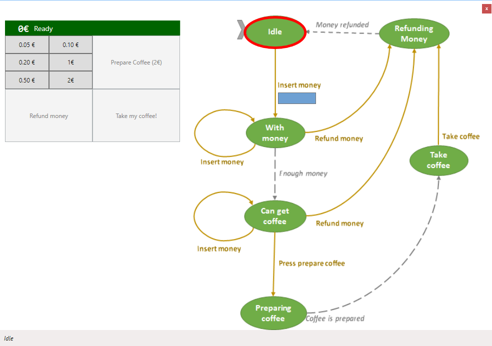

# CoffeeMachine

    

This repository is an extension of <a href="http://softwarejuancarlos.com/2014/11/09/wpf-state-machine-commands/" target="_blank">Juan Carlos's</a> work.

Initially, I couldn't find a good example of stateless machine design until I stumbled into Juan's website. As this was the perfect example I needed, I decided to put it here for future reference. It is important to note though, that Juan placed a link on his site for the compiled source code but not the raw project. I had to do some re-coding and re-structuring to get it working as intended by Juan.

Despite my extra work of re-coding the original source code, I own no credits for any of the Ideas put together in this project. Juan Carlos deserved all the credits for this awesome project. Visit his site to learn more of the ideas behind this work.

Thanks!
